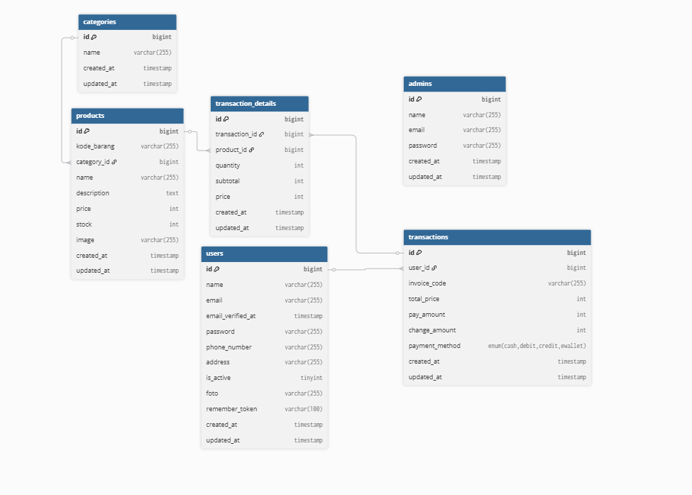
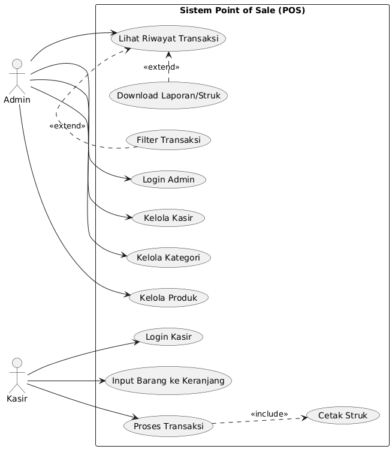

# 🧾 Sistem Kasir Point of Sale (POS) – Ujikom PPLG

## 1. Konsep Project

Project ini adalah aplikasi **Sistem Kasir Point of Sale (POS)** berbasis web yang digunakan untuk membantu proses penjualan di suatu toko/mini market.

Konsep utama:

- **Peran terpisah** antara **Admin** dan **Kasir**.
- **Admin** mengelola data master (produk, kategori, kasir) dan memantau transaksi.
- **Kasir** fokus pada proses transaksi penjualan dan pencetakan struk.
- Sistem dibangun menggunakan **Laravel** dan **Bootstrap 4 (SB Admin 2)** dengan tampilan yang modern namun tetap sederhana dan mudah digunakan.

---

## 2. Fitur Project

### 2.1 Landing Page

- Route `/` menampilkan halaman awal sistem.
- Menjelaskan nama sistem dan peran yang tersedia.
- Tombol:
  - **Login Admin** → `/admin/login`
  - **Login Kasir** → `/kasir/login`

### 2.2 Modul Admin

- Login admin dengan tabel dan guard terpisah dari kasir.
- **Manajemen Admin**
  - CRUD data admin (tambah, edit, hapus)
  - Memiliki keamanan tidak bisa menghapus akun sendiri
- **Manajemen Kasir**
  - CRUD data kasir (tambah, edit, hapus).
  - Kolom `is_active` untuk mengaktifkan/nonaktifkan akun kasir.
- **Manajemen Produk**
  - Manajemen kategori & produk.
  - Input: nama, foto, deskripsi, harga, stok, dll.
  - Otomatis generate **`kode_barang`** pada model Product (misal `PRD-00001`).
- **Monitoring Transaksi**
  - Tabel daftar transaksi yang rapi.
  - Fitur filter:
    - Cari **invoice** atau **nama kasir** dalam satu search box.
    - Filter berdasarkan metode pembayaran.
    - Filter berdasarkan rentang tanggal.
  - Aksi:
    - **Download struk PDF** per transaksi.

### 2.3 Modul Kasir

- Login kasir dengan tabel `users` dan guard sendiri.
- **Halaman Transaksi (single page, tidak menggunakan layout admin)**:
  - Input **kode barang**:
    - Hanya mengetik angka dari `kode_barang` (contoh: `1` untuk `PRD-00001`), atau
    - Memilih produk dari dropdown.
  - Keranjang belanja disimpan sementara di **Session**.
  - Validasi stok:
    - Jika stok habis → muncul pesan **stok habis**.
    - Jika stok tidak cukup → muncul pesan stok tidak mencukupi.
  - Perhitungan otomatis:
    - Total harga.
    - Uang bayar.
    - Kembalian.
  - Metode pembayaran: cash / debit / kredit / e-wallet/QRIS.

### 2.4 Struk Transaksi

- Setelah transaksi disimpan:
  - Sistem generate **`invoice_code`** otomatis di model Transaction.
  - User diarahkan ke halaman **struk**.
- Struk tersedia dalam bentuk:
  - **Halaman HTML** untuk preview.
  - **PDF** menggunakan **DOMPDF**.
- Desain struk:
  - Disesuaikan dengan kertas **58mm** (struk kasir).
  - Menampilkan:
    - Informasi toko.
    - Invoice, tanggal, kasir.
    - Detail item (nama, qty, harga, subtotal).
    - Total, bayar, kembalian, metode pembayaran.
    - Catatan singkat (terima kasih, dll).

### 2.5 Keamanan & Middleware

- Guard dan middleware terpisah:
  - `auth.admin` untuk admin.
  - `auth.user` (atau guard lain sesuai konfigurasi) untuk kasir.
- Middleware **EnsureUserIsActive**:
  - Mengecek kolom `is_active` pada kasir.
  - Jika kasir sudah dinonaktifkan tetapi masih login:
    - Session di-logout.
    - Dialihkan ke halaman login dengan pesan bahwa akun sudah dinonaktifkan admin.

---

## 3. Akun Default

### Admin

- Email : `admin@sistem.com`  
- Password : `password`

### Kasir

- Email : `kasir@sistem.com`  
- Password : `password`  

---

## 4. ERD (Entity Relationship Diagram)

### 🔗 Deskripsi Singkat Relasi

- **categories → products** : one to many  
  (satu kategori punya banyak produk)

- **products → transaction_details** : one to many  
  (satu produk bisa muncul di banyak detail transaksi)

- **transactions → transaction_details** : one to many  
  (satu transaksi berisi banyak baris detail barang)

- **users (kasir) → transactions** : one to many  
  (satu kasir bisa melakukan banyak transaksi)

- **admins** : berdiri sendiri  
  (dipakai untuk login & manajemen, tidak langsung terhubung ke transaksi)

> Tabel bawaan Laravel seperti `migrations`, `failed_jobs`, `password_reset_tokens`, `personal_access_tokens`, atau `sessions` **tidak ditampilkan** di ERD karena hanya digunakan untuk kebutuhan teknis framework, bukan bagian utama alur bisnis POS.

---

## 5. UML Use Case Diagram



### 🧩 Deskripsi Singkat UML Use Case

- Terdapat **2 aktor utama**: **Admin** dan **Kasir**.
- **Admin** dapat:
  - Login ke sistem.
  - Mengelola Admin
  - Mengelola kasir.
  - Mengelola kategori dan produk.
  - Melihat dan memfilter daftar transaksi.
  - Mengunduh struk transaksi dalam bentuk PDF.
- **Kasir** dapat:
  - Login ke sistem.
  - Menginput barang ke keranjang.
  - Memproses transaksi.
  - Mencetak atau mengunduh struk setelah transaksi selesai.

> Diagram ini menunjukkan siapa yang menggunakan sistem dan fitur utama apa saja yang dapat diakses oleh masing-masing aktor.

---

## 6. Prasyarat Clone

- PHP 8.1+
- Web Server (Apache, Nginx, atau bawaan php artisan serve)
- Database (MySQL / MariaDB)
- Composer
- Web Browser (Chrome, Firefox, Edge, dll)

## 7. Instalasi Project
1. Clone Repository
```bash
git clone https://github.com/Goloyy7/sistem-kasir.git
cd sistem-kasir
```
2. Instal Dependency PHP
```bash
composer install
```
3. Salin File Environment
```bash
cp .env.example .env
```
4. Atur Konfigurasi Database di `.env`
```env
DB_CONNECTION=mysql
DB_HOST=127.0.0.1
DB_PORT=3306
DB_DATABASE=db_kasir
DB_USERNAME=root
DB_PASSWORD=
```
5. Generate Application Key
```bash
php artisan key:generate
```
6. Jalankan Migrasi dan Seeder
```bash
php artisan migrate --seed
```
7. Aktifkan Storage Link (Untuk Upload Gambar)
```bash
php artisan storage:link
```
8. Jalankan Server Lokal
```bash
php artisan serve
```
9. Akses Url di browser :
- Landing Page : `http:127.0.0.1:8000/`
- Login Admin : `http:127.0.0.1:8000/admin/login`
- Login Kasir : `http:127.0.0.1:8000/kasir/login`

## 8. Pembuat
Proyek **Sistem Kasir Point Of Sale (POS)** ini dibuat oleh:
- **Nama** : Indra Goldy Suwandi
- **Jurusan** : Pengembangan Perangkat Lunak dan Gim (PPLG)
- **Sekolah** : SMK Negeri 1 Garut
